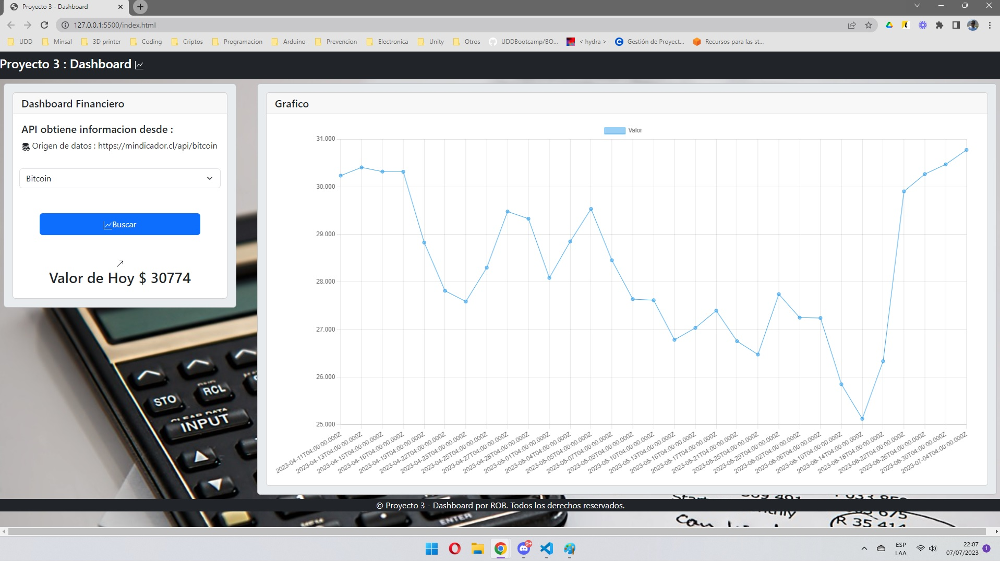

# Proyecto3 - Dashboard

<a href="https://spotfreeman.github.io/Proyecto3/">https://spotfreeman.github.io/Proyecto3/</a>

## Descripción

## Insignias

## Visual

## Construido con 🛠️

Herramientas utilizadas para crear el proyecto:

* HTML - Estructura del sitio web.
* CSS - Estilos y diseño visual.
* Bootstrap - Estilos y diseño visual.
* JavaScript - Lógica y funcionalidad del gestor de tareas.
* DOM - Manipulación del árbol de objetos del documento.
* Local Storage - Almacenamiento de datos en el navegador.

## Contribuir 🖇️

Este proyecto es de código abierto y las contribuciones son bienvenidas. Puedes colaborar mejorando el diseño, agregando nuevas funcionalidades o corrigiendo errores. ¡Siéntete libre de enviar tus pull requests!

## Licencia 📄

Este proyecto está bajo la Licencia MIT. Consulta el archivo [LICENSE.md](LICENSE.md) para obtener más detalles.

## Expresiones de gratitud 🎁

Agradecimientos especiales a todos por el apoyo y la motivacion a realizar este Bootcamp...
Este archivo readme se ha desarrollado utilizando como referencia los siguientes proyectos:

* [template-readme-es](https://github.com/brayandiazc/template-readme-es) - creado por [Brayan Diaz C](https://github.com/brayandiazc)

---
⌨ ️con ❤️ por [Raul Oyarzun Becerra](https://github.com/spotfreeman) Gracias por el apoyo! 
<a href="https://www.linkedin.com/in/ra%C3%BAl-oyarz%C3%BAn-becerra-6430b171/"> Linkedin </a>
